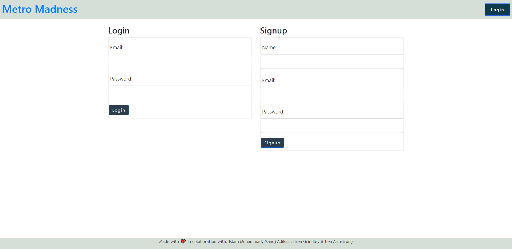
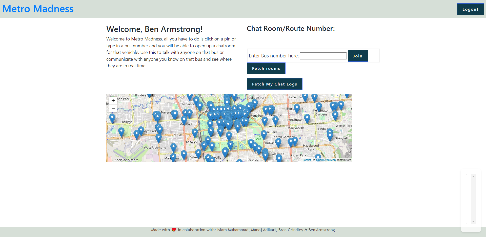
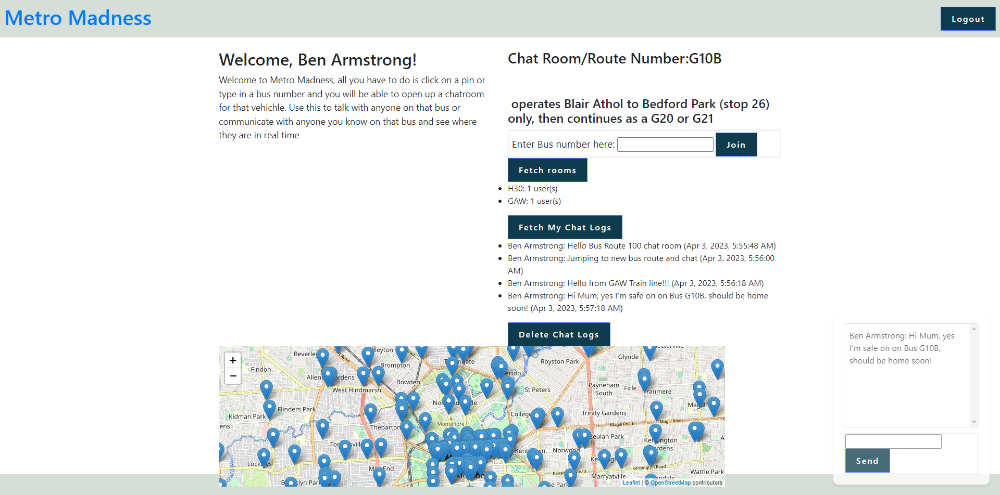

# MetroMadness - Group Project #2

## Project Requirements
With your team, you’ll conceive and execute a design that solves a real-world problem. In creating your first collaborative full-stack application, you’ll combine a robust back end—with servers, databases, advanced APIs, and user authentication—to an intuitive front end. You’ll continue to build on the agile development methodologies you’ve used throughout this course, like storing your project code in GitHub, managing your work with a project management tool, and implementing feature and bug fixes using the Git branch workflow and pull requests.

Instead of using the front end you developed for your first project, you should start from scratch. Doing so will help you reinforce your existing front-end abilities and solidify your understanding of the dynamic between the front end and back end. Also, you’ve likely improved your skills since that first project, so with a stronger foundation now you can build a better application, using all of the additional practice you’ve had in the last several weeks.

You and your group will use everything you’ve learned over the past six weeks to create a full-stack application that works with real-world data to solve a real-world challenge. Even more than your first group project, this project will provide you with an opportunity to demonstrate your problem-solving skills, which employers will want to see when you begin to interview for development roles. Once again, the user story and acceptance criteria will depend on the project that you create, but your project must fulfill the following requirements:

## Grading Requirements
* Use Node.js and Express.js to create a RESTful API.
* Use Handlebars.js as the template engine.
* Use MySQL and the Sequelize ORM for the database.
* Have both GET and POST routes for retrieving and adding new data.
* Use at least one new library, package, or technology that we haven’t discussed.
* Have a folder structure that meets the MVC paradigm.
* Include authentication (express-session and cookies).
* Protect API keys and sensitive information with environment variables.
* Be deployed using Heroku (with data).
* Have a polished UI.
* Be responsive.
* Be interactive (in other words, accept and respond to user input).
* Meet good-quality coding standards (file structure, naming conventions, follows best practices for class/id naming conventions, indentation, quality comments, and so on).
* Have a professional README (with unique name, description, technologies used, screenshot, and link to deployed application).

# User Story
As a user I want to know if my transport is running on time. So that if the bus or train is not running on time or delayed, I can organise alternative transport to get to my destination.
As a user I want to create an account and have my data stored privately and securely.
Once logged into the application I want to be able to view available bus/routes from a map. Using the map I can hover over the pins on the map and using geolocation it will show me the bus/route number so that I can select my appropriate route I wish to take.
Once my route is selected I want to be able to get real time data of that route.
I also want to be able to connect and chat freely with other commuters on my transport route.  

## Who is the audience?
Audience (Target Market) is Split into 2x Main Target Audiences:
* People of all walks of life who use and rely on public transport for either work/recreation to get to their chosen destination. 
* Parents who have adolescence children that are transitioning to be trusted to catch public transport on their own. The parents can easily chat to them and also track them on their bus/tram/train. .🚌
## What is the problems that the product solves?
Users can use the chat feature to talk to other commuters on the route and find out where their transport is, if it’s on time, or, has been delayed due to an accident or road works etc. This gives the end user the opportunity to find alternative transport to get to their destination on time. ⌚
## How does the product solve that problem?
Real time data of where your current transport is, including if it’s; on time or has been delayed with warning to the user. The open chat forum allows the users to connect to other users of the same route to be able to communicate and update each other for FREE!

## Acceptance Criteria
```
* As a user I want to know if my transport is running on time. So that if the bus or train is not running on time or delayed, I can organise alternative transport to get to my destination.
* As a user I want to create an account and have my data stored privately and securely.
* Once logged into the application I want to be able to view available bus/routes from a map. Using the map I want the ability to hover over the pin to view each bus/tram/trains route information and when I select the pin it takes me to the chat room.
* Once my route is selected I want to be able to get real time data of that route.
* I also want to be able to connect and chat freely with other commuters on my transport route.
```

# Installation
N/A - Depolyed onto live Website using Heroku.

# Usage
You can use and view this application via the following: https://fathomless-cove-45188.herokuapp.com/
<br/>Or check out my repository here: https://github.com/BenArmstrong81/MetroMadness

The following image's shows the deployed application:





# Credits
In colaboration with: <br>
* Ben Armstrong https://github.com/BenArmstrong81 <br>
* Brea Grindley https://github.com/homurrl <br>
* Manoj Adikar https://github.com/ManojAdikari <br>
* Islam Muhammad https://github.com/TheIPM <br>

*With special thanks to The University of Adelaide Full Stack Web Development Class.*

## What We Learned
Building on the first third of the course, the past 6 weeks we have learnt the following; Node.js, Object-Oriented Programming (OOP), Express.js, SQL, Object-Relational Mapping (ORM), Heruku, Model View Controller (MVC) and much much more!!

Using the above skills we created this whole project from scratch including; HTML (using Handlebars,js), CSS, JavaScript, Node.js, GTS
RealTimeBindings,Leaflet, Annimate.CSS, Socket.io, Exress.js, SQL, intergtaing an API, GitHub, Heroku, Boostrap and README files. 
  
We all feel rather proud, after only 13 weeks of coding to colaborate and complete such a task is greatfully satisfying.

## Made With


# Features for the Future

* Play button opens chosen radio station to another page with clean & polished CSS
* A list of preiously listened to stations when reloading the page 


# License

Please refer to the LICENSE in the repo.
